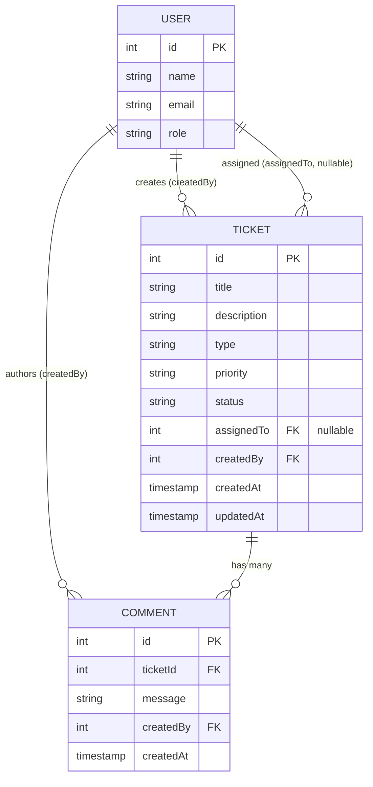
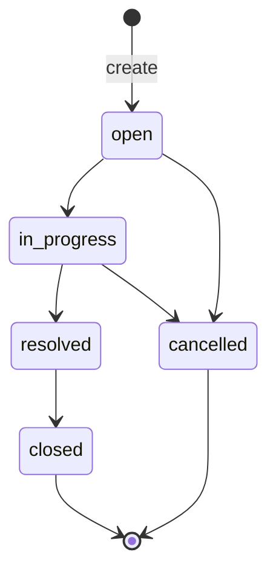

# Data Model — Support Ticket System

**Status:** Approved — July 10, 2026.

Drupal 10 monolith data model for the `support_ticket` module. Defines entities, fields, enums, relationships, validation rules, and the status transition map. Implementation uses config-as-code (`config/install/*.yml`); no admin UI setup.

---

## Overview

| Logical entity | Drupal storage | Bundle / type |
|----------------|----------------|---------------|
| User | Core `user` | — |
| Ticket | Core `node` | `ticket` |
| Comment | Core `comment` | `comment` (on ticket nodes) |

All write paths enforce validation and authorization server-side. Client-side validation is supplementary only (NFR-1).

---

## Entity: User

Core Drupal user. Roles are Drupal roles; the single **Admin** maps to the built-in `administrator` role (uid 1 or equivalent super-admin account).

### Fields

| Logical field | Drupal mapping | Type | Required | Notes |
|---------------|----------------|------|----------|-------|
| `id` | `uid` | integer (read-only) | — | Primary key |
| `name` | `name` | string | yes | Display / login name |
| `email` | `mail` | email | yes | Unique per Drupal user rules |
| `role` | role assignment | enum (single primary role) | yes | One of: `administrator`, `agent`, `reporter` |

### Role semantics

| Role | Machine name | Capabilities (data layer) |
|------|--------------|---------------------------|
| Admin | `administrator` | Full CRUD on users and tickets; all transitions; assign/reassign; see all tickets including assignee |
| Agent | `agent` | CRUD on accessible tickets; transitions on assigned + unassigned queue; assign/reassign to Agent users; no user management |
| Reporter | `reporter` | Create tickets; view/update own tickets (limited fields); comment on own tickets; no status/assignee access |

### Validation

| Rule | Enforcement |
|------|-------------|
| `name`, `email`, `role` required on create/update | Form validation |
| Valid role value | Allowed-values constraint |
| Default role on Admin-created user | `agent` (FR-7) |
| Delete blocked if user is `assignedTo` on any ticket | Pre-delete hook / access check (FR-8) |
| Admin cannot delete own account | Pre-delete hook / access check (FR-9) |

### Assumptions

- No `type` field on User (per source brief).
- Initial Admin bootstrapped via manual database setup (FR-10).

---

## Entity: Ticket

Core `node` bundle **`ticket`**.

### Fields

| Logical field | Drupal field | Storage type | Required | Default | Max length / constraint |
|---------------|--------------|--------------|----------|---------|-------------------------|
| `id` | `nid` | integer (read-only) | — | auto | — |
| `title` | `title` (base field) | string | **yes** | — | ≤ 100 chars (FR-23) |
| `description` | `field_description` | text (long, plain) | no | empty | ≤ 1000 chars (FR-23) |
| `type` | `field_ticket_type` | list (text) | **yes** | — | See Type enum (A-1); not node bundle `type` |
| `priority` | `field_priority` | list (text) | no | `medium` | See Priority enum |
| `status` | `field_ticket_status` | list (text) | no | `open` | See Status enum; not node publish `status`; managed by `TicketStatusService` |
| `assignedTo` | `field_assigned_to` | entity reference → `user` | no | `null` | Must reference user with `agent` role if set (FR-17) |
| `createdBy` | `uid` (author) | entity reference → `user` | auto | current user | Set on create |
| `createdAt` | `created` | timestamp (read-only) | auto | now | — |
| `updatedAt` | `changed` | timestamp (read-only) | auto | on save | — |

### Enums

#### Type (`field_ticket_type`) — assumption / addition (A-1)

| Label | Stored value | Notes |
|-------|--------------|-------|
| Technical | `technical` | Categorization and filter only |
| Billing | `billing` | Does not drive assignment |
| Account | `account` | Mandatory on create (FR-13) |
| General | `general` | — |

#### Priority (`field_priority`)

| Label | Stored value | Default |
|-------|--------------|---------|
| Low | `low` | |
| Medium | `medium` | **yes** (on create if omitted) |
| High | `high` | |
| Critical | `critical` | |

#### Status (`field_ticket_status`)

| Label | Stored value | Terminal? | Meaning |
|-------|--------------|-----------|---------|
| Open | `open` | no | New or awaiting work |
| In Progress | `in_progress` | no | Actively being worked |
| Resolved | `resolved` | no | Fix verified (FR-28) |
| Closed | `closed` | **yes** | Archived (FR-28) |
| Cancelled | `cancelled` | **yes** | Withdrawn / will not be completed |

Terminal statuses (`closed`, `cancelled`) make the ticket **read-only**: no field edits, no new comments, no comment edits (FR-22, FR-34, A-15).

### Create defaults (FR-14, FR-15)

| Field | Value on create |
|-------|-----------------|
| `status` | `open` |
| `priority` | `medium` (if not provided) |
| `assignedTo` | `null` (unassigned) |
| `createdBy` | current session user |

Mandatory on create: **`title`**, **`type`** (FR-13). Whitespace-only values rejected (EC-14).

### Assignment rules (FR-16–FR-19)

| Rule | Detail |
|------|--------|
| Who may assign | Admin, Agent only |
| Valid assignee | User with `agent` role only |
| Self-assign | Agent may set `assignedTo` to self (FR-18) |
| Reporter | Must not see or submit `assignedTo`; server rejects assignment attempts |
| Auto-assignment | None (FR-15, A-2) |
| Type → assignment | No relationship (FR-25) |

### Role-specific field edit matrix (non-terminal tickets)

| Field | Admin | Agent | Reporter |
|-------|-------|-------|----------|
| `title` | ✓ | ✓ (accessible tickets) | ✓ (own only) |
| `description` | ✓ | ✓ | ✓ (own only) |
| `type` | ✓ | ✓ | ✓ (own only) |
| `priority` | ✓ | ✓ | ✓ (own only) |
| `status` | via transition form | via transition form (scoped) | ✗ |
| `assignedTo` | ✓ | ✓ | hidden / denied |

### Delete

- **Admin only** may delete ticket nodes (FR-20, A-11).

### Node base-field disambiguation

Drupal node entities expose native base fields that must not be reused for ticket data:

| Node base field | Meaning on `node` | Ticket workflow equivalent |
|-----------------|-------------------|----------------------------|
| `type` | Content type bundle machine name (`ticket`) | `field_ticket_type` (categorization enum) |
| `status` | Published flag (`1` = published) | `field_ticket_status` (workflow enum) |

All ticket nodes are **published** (`status = 1`). Lifecycle is tracked exclusively via `field_ticket_status`. Unpublished/draft tickets are out of scope.

---

## Entity: Comment

Core **Comment** module, attached to ticket nodes (`comment_type` targeting `ticket` bundle).

### Fields

| Logical field | Drupal mapping | Type | Required | Max length |
|---------------|----------------|------|----------|------------|
| `id` | `cid` | integer (read-only) | — | — |
| `ticketId` | `entity_id` (node) | entity reference | auto | parent ticket `nid` |
| `message` | `comment_body` | text (plain) | yes | ≤ 1000 chars (FR-35) |
| `createdBy` | `uid` | entity reference → `user` | auto | comment author |
| `createdAt` | `created` | timestamp (read-only) | auto | — |

### Rules

| Rule | Detail |
|------|--------|
| Add comment | Reporter: own tickets only; Agent/Admin: accessible tickets (FR-30–FR-32) |
| Edit comment | Author may edit own `message` while parent ticket is **not** closed/cancelled (FR-33, ISS-5) |
| Delete comment | **Out of scope** (C-2, A-13) — no delete for any role |
| Terminal tickets | No new comments; no edits to existing comments (FR-34) |

---

## Relationships

### Cardinality

| From | To | Cardinality | Notes |
|------|-----|-------------|-------|
| User | Ticket (author) | 1 : N | Every ticket has exactly one author |
| User | Ticket (assignee) | 1 : N (optional) | `assignedTo` nullable; blocks user delete if any |
| Ticket | Comment | 1 : N | Comments disabled on terminal tickets |
| User | Comment | 1 : N | Author-only edit |

---

## Status Transition Map

Enforced server-side by **`TicketStatusService`** (not Content Moderation). Invalid transitions rejected with a form-level validation error regardless of role (FR-27, NFR-4).

### Allowed transitions

| From (`field_ticket_status`) | To (`field_ticket_status`) |
|-----------------------|---------------------|
| `open` | `in_progress` |
| `in_progress` | `resolved` |
| `resolved` | `closed` |
| `open` | `cancelled` |
| `in_progress` | `cancelled` |

All other transitions are **rejected** (e.g. `open` → `closed`, `resolved` → `in_progress`, any transition from terminal states).

### Transition authorization (FR-29)

| Role | Scope |
|------|-------|
| Admin | Any valid transition on any ticket |
| Agent | Valid transitions on tickets **assigned to them** OR **unassigned** (global queue); **not** tickets assigned to another Agent (A-4) |
| Reporter | No transitions |

### State diagram

Terminal states (`closed`, `cancelled`) have no outgoing transitions.

---

## Validation Summary

### Ticket field validation

| Field | Rules |
|-------|-------|
| `title` | Required on create; trim whitespace; non-empty; max 100 characters |
| `type` | Required on create; must be allowed enum value |
| `description` | Optional; max 1000 characters |
| `priority` | Must be allowed enum value if provided |
| `status` | Must be allowed enum value; changes only via `TicketStatusService` transition rules |
| `assignedTo` | Nullable; if set, target user must have `agent` role; only Admin/Agent may set |

### Comment validation

| Field | Rules |
|-------|-------|
| `message` | Required; max 1000 characters |
| Parent ticket | Must not be `closed` or `cancelled` for create/edit |

### Cross-cutting validation

| Concern | Rule | Reference |
|---------|------|-----------|
| Terminal ticket writes | Reject all field updates, transitions, comment create/edit | FR-22, FR-34, ISS-8 |
| Concurrent modification | On submit, reload `field_ticket_status` from storage; reject if changed or terminal since form build | NFR-6, ISS-4, EC-13 |
| CSRF | Drupal form tokens on all write forms | Core Form API |
| Keyword search scope | Match `title` and `description` only (not status/priority/assignee/type labels) | ISS-6, A-14 |

### Custom validation constraints (implementation)

| Constraint | Applies to |
|------------|------------|
| `TicketTitleLength` | `title` |
| `TicketDescriptionLength` | `field_description` |
| `CommentMessageLength` | `comment_body` |
| `TicketAssigneeIsAgent` | `field_assigned_to` |
| `TicketStatusTransition` | status transition form |
| `TicketNotTerminal` | ticket edit, comment forms |

---

## Visibility & Listing (data filters)

These are enforced in **`TicketAccessService`**, `hook_node_access`, and Views query alters — not node_access grants.

| Role | Tickets visible in list/detail |
|------|--------------------------------|
| Admin | All tickets; `assignedTo` visible |
| Agent | Assigned to self + unassigned (`assignedTo` IS NULL) |
| Reporter | Own tickets only (`createdBy` = self); `assignedTo` omitted from output |

### List defaults

| Setting | Value |
|---------|-------|
| Default sort | `createdAt` descending (A-5) |
| Sortable fields | `createdAt`, `updatedAt`, `priority`, `status` |
| Page size | 5 |
| Filters | status, priority, assignee, type |
| Cancelled tickets | Shown to Admin via status filter only (A-7) |
| Closed tickets | Included in default list (FR-39) |

---

## Resolved Open Items (incorporated)

| ID | Decision |
|----|----------|
| C-2 | Comment deletion **out of scope** |
| ISS-5 | No comment edits on closed/cancelled tickets |
| ISS-6 | Keyword search: **title + description** |
| ISS-8 | Terminal tickets: **read-only detail page** (view allowed; writes denied server-side) |
| ISS-4 | Concurrent close: **form token + status re-check on submit** |

---

## Config-as-Code Artifacts (reference)

The following install config files materialize this model (to be created in implementation phase):

| Config | Purpose |
|--------|---------|
| `node.type.ticket.yml` | Ticket bundle |
| `field.storage.field_ticket_type.yml`, `field.storage.field_ticket_status.yml`, … | Shared field storage |
| `field.field.node.ticket.field_ticket_type.yml`, `field.field.node.ticket.field_ticket_status.yml`, … | Ticket field instances |
| `comment.type.comment.yml` | Comment type on tickets |
| `user.role.agent.yml`, `user.role.reporter.yml` | Sub-roles + permissions |

Logical field names in this document map to Drupal machine names above; services (`TicketStatusService`, `TicketAccessService`) implement transition and access rules defined here.
