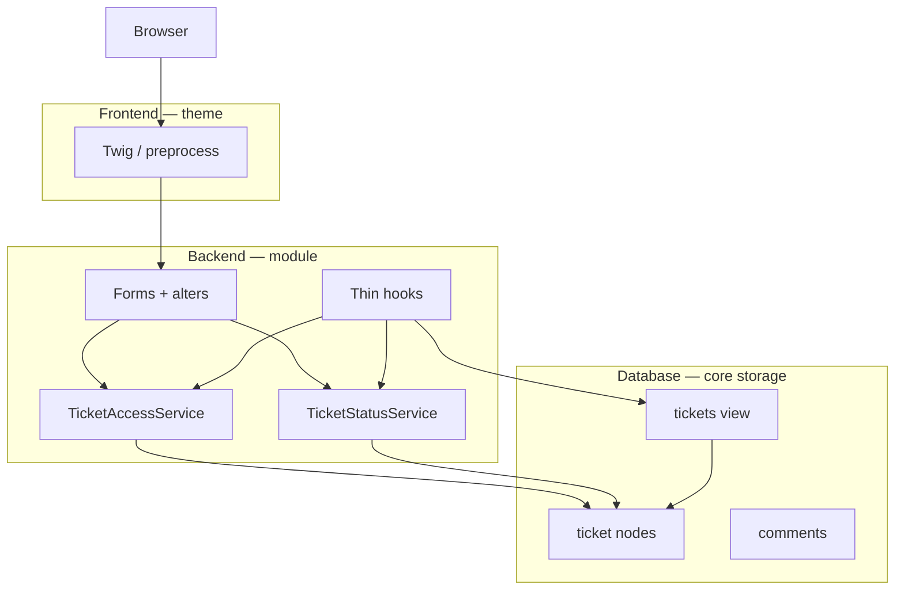

# Design Notes

**Status:** Draft — July 10, 2026.

Architectural decisions for the Drupal 10 monolith: how frontend, backend, and persistence fit together; where business rules live; and how validation and errors are handled. Entity fields, enums, transitions, and validation rules are defined in [`data-model.md`](data-model.md). Routes and screens in [`ui-flow.md`](ui-flow.md). Test scope in [`test-strategy.md`](test-strategy.md).

## Architecture Overview (frontend, backend, database)

Internal **Drupal 10 monolith** — no separate frontend app, no exposed REST/JSON:API layer (see [`requirements-analysis.md`](requirements-analysis.md)). All screens are server-rendered via a custom module and theme under `src/`.

| Layer | Technology | Responsibility |
|-------|------------|----------------|
| **Frontend** | Custom theme, Twig, Form API markup, Views | Server-rendered pages; supplementary role-based visibility; read-only terminal ticket UX |
| **Backend** | Custom module, domain services, thin hooks | Business rules, access control, status transitions, validation |
| **Database** | MySQL/MariaDB via Drupal core entity storage | Nodes (`ticket` bundle), comments, users/roles — **no custom tables** |

| Concern | Choice | Rationale |
|---------|--------|-----------|
| Ticket storage | Core **node** bundle `ticket` | Reuse CRUD, fields, Views |
| Status lifecycle | Dedicated field + **`TicketStatusService`** | Agent-scoped transition rules without Content Moderation overhead |
| Access control | **`TicketAccessService`** + node access hooks + Views query alter | Simpler than node_access grants at this scale |
| Ticket listing | Exported **View** + PHP access layer | Config-as-code listing; row scoping in code |
| Comments | Core **Comment** module on ticket nodes | Standard Drupal attachment model |
| Authentication | Drupal core **session** auth | Permission and custom access on routes |
| Configuration | **`config/install`** in module | Reproducible install; no manual Field UI setup |

### Component relationships

### Write-path flow

1. **Route access** — permission or custom access callback; scope checked via access service.
2. **Form build** — fields shown/disabled by role; terminal tickets are read-only in the UI (ISS-8).
3. **Submit** — CSRF token; server-side validation and authorization (NFR-1).
4. **Concurrency** — workflow status re-checked against storage on submit; stale or terminal state rejected (NFR-6, ISS-4).
5. **Persist** — entity save; **status changes only through the dedicated transition path**, not the general edit form.

### Deliberate non-choices

| Alternative considered | Why not used |
|------------------------|--------------|
| Content Moderation | Overhead for a simple linear workflow; Agent rules fit a dedicated service |
| node_access grants | Role + assignee queue rules are clearer in a service + query alter |
| Decoupled SPA + API | Out of scope; single cohesive Drupal deliverable |
| Custom content entities | Node + Comment reduce boilerplate and integrate with Views |

## Frontend Design

The custom theme owns **presentation only**. Access rules are enforced in the module; Twig hide/show is supplementary (NFR-2).

| Concern | Approach |
|---------|----------|
| Ticket detail | Themed node display: status, priority, type; assignee block conditional on role |
| Reporter assignee | Omitted from rendered output (FR-19) |
| Terminal tickets | Read-only display; no transition or comment forms (ISS-8) |
| List | Views-driven table with optional theme overrides |
| User management | Core user forms, altered by module for Admin workflows |

Form API conditional visibility may improve UX but never replaces server checks.

Screen-level routes and navigation: [`ui-flow.md`](ui-flow.md).

## Backend Design

The custom module owns **business rules, access, transitions, and validation**. Hooks delegate to services; the `.module` file stays thin.

### Config-as-code

All structural config (content type, fields, roles, permissions, ticket View) ships in the module's **`config/install`** directory and applies on enable — no post-install admin configuration. Config categories and field machine names are listed in [`data-model.md`](data-model.md). Install config is the source of truth for this project.

Drupal core permissions handle coarse capabilities; **`TicketAccessService`** adds queue-scoped rules (Agent work queue, Reporter own-only) that permissions alone cannot express.

### Domain services

Two services centralize rules from [`data-model.md`](data-model.md). Injected into forms, access callbacks, and validation.

**`TicketStatusService`** — owns the workflow:

- Single source of truth for allowed transitions and terminal states (see data-model transition map).
- Role-scoped transition permission (Admin: any; Agent: assigned-to-self or unassigned; Reporter: none).
- Status changes applied only through the dedicated transition path.
- Stale-status detection for concurrent submits.

**`TicketAccessService`** — owns visibility and write permission:

- View / update / delete / assign / comment decisions per role and ticket state.
- List query scoping for the tickets View (Agent queue, Reporter author filter).
- Reporter output filtering (assignee omitted from render).

**Integration pattern:** node access hooks and route access callbacks call the access service; Views list uses query alter for row-level filtering; form alters apply field-level matrix and terminal read-only state. **Not used:** `node_access` grant table.

### Forms and routes

| Concern | Decision |
|---------|----------|
| Ticket create/edit | Standard node form; field visibility per role matrix in data-model |
| Status change | Separate transition form — status not on general edit form |
| Comments | Core comment form; parent ticket must be non-terminal |
| User CRUD | Altered core user forms; Admin only |

Prefer core entity routes where possible; custom routes only where ui-flow requires them (e.g. transition action).

## Database Design

No custom tables. Tickets, comments, and users persist in **Drupal core schemas** (node/field tables, comment tables, users/roles). Logical entities, relationships, and field mappings: [`data-model.md`](data-model.md).

## Validation Strategy

Server-side validation is authoritative (NFR-1). Three layers — rule details and field limits in [`data-model.md`](data-model.md):

| Layer | Responsibility |
|-------|----------------|
| **Field constraints** | Length, required fields, assignee role, terminal-state guard, transition validity |
| **Form validation** | Whitespace checks, tampered hidden fields, workflow status re-check on submit |
| **Access checks** | Reject out-of-scope operations before or during form processing |

Client-side attributes and Form API `#states` are UX-only.

## Error Handling Strategy

Drupal-native patterns only — no JSON error envelope (FR-49).

| Failure type | User-facing behavior |
|--------------|---------------------|
| Field validation | Inline message on the offending field |
| Invalid transition | Form-level message naming current status and allowed targets |
| Terminal ticket write | Form error or access denied |
| Concurrent modification | Form-level message prompting reload (ISS-4) |
| Authorization | Access-denied page or login redirect |
| Blocked user delete | Error on user delete form |

Messages should be explicit per NFR-4 (state machine, assignee role, stale ticket).

## Testing Strategy Link

Full plan: [`test-strategy.md`](test-strategy.md). At a high level:

- **Kernel tests** — domain services and validation constraints.
- **Functional tests** — role flows, list scoping, terminal read-only, concurrent submit.
- **CI** — automated PHPUnit on push/PR (FR-52).
