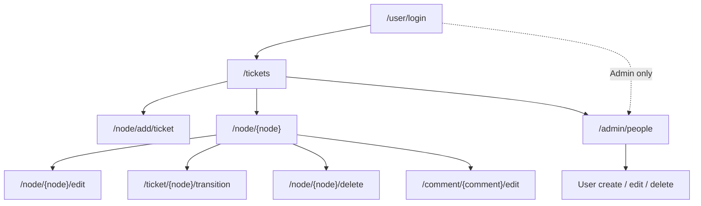

# UI Flow — Support Ticket System

**Status:** Draft — July 10, 2026.

User-facing routes, screens, navigation, and presentation states for the Drupal 10 monolith. Field rules, role permissions, enums, transitions, and list defaults: [`data-model.md`](data-model.md). Architecture, services, validation, and error patterns: [`design-notes.md`](design-notes.md).

---

## Entry & Authentication

| Screen | Path | Behavior |
|--------|------|----------|
| Login | `/user/login` | Anonymous entry; redirects to intended destination after success |
| Logout | `/user/logout` | Ends session |
| Front page | `/` | Authenticated → ticket list; anonymous → login for app use |

Protected routes require a session. Anonymous deep links redirect to login with destination preserved (FR-2). Default post-login destination is `/tickets`.

---

## Route Map

Paths only — route registration and access callbacks are implementation concerns (see [`design-notes.md`](design-notes.md)).

| Screen | Path | Who |
|--------|------|-----|
| Ticket list | `/tickets` | All authenticated roles; row scope per [`data-model.md`](data-model.md) visibility rules |
| Create ticket | `/node/add/ticket` | Roles with create permission |
| Ticket detail | `/node/{node}` | View access per role and ticket scope |
| Edit ticket | `/node/{node}/edit` | Update access; denied when terminal (ISS-8) |
| Delete ticket | `/node/{node}/delete` | Admin only (FR-20) |
| Status transition | `/ticket/{node}/transition` | Admin or scoped Agent; denied when terminal or out-of-scope |
| Add comment | `/node/{node}` | Inline on detail page |
| Edit comment | `/comment/{comment}/edit` | Comment author; parent ticket non-terminal |
| User list | `/admin/people` | Admin only |
| Create user | `/admin/people/create` | Admin only |
| Edit user | `/user/{user}/edit` | Admin only |
| Delete user | `/user/{user}/cancel` | Admin only |

Comment deletion has no route or UI affordance (C-2).

---

## Screens

Field visibility and edit rights follow the role matrix in [`data-model.md`](data-model.md). Below is what each **screen** presents beyond those rules.

### Ticket list (`/tickets`)

View-driven table. List filters, sort options, page size, and role scoping: [`data-model.md`](data-model.md) (Visibility & Listing).

| UI element | Detail |
|------------|--------|
| Columns | Title (linked), status, priority, type, created date; assignee column for Admin and Agent only |
| Row actions | Title link to detail only — no inline edit or delete |
| Primary action | Link or button to create ticket |

### Create ticket (`/node/add/ticket`)

| UI element | Detail |
|------------|--------|
| Fields | Per data-model create rules; `status` not shown (defaults server-side); `assignedTo` hidden for Reporter |
| On save | Redirect to detail or list with success message |

### Ticket detail (`/node/{node}`)

| UI element | Detail |
|------------|--------|
| Layout | Ticket metadata above comment thread |
| Metadata | All ticket fields; `assignedTo` omitted from render for Reporter (FR-19) |
| Local tasks | **View** (default), **Edit**, **Change status**, **Delete** (Admin only) — write tasks hidden when terminal or access denied |
| Comments | Thread on same page; add form below when permitted |
| Terminal (ISS-8) | Page viewable; fields read-only; no edit, transition, comment-add, or comment-edit affordances |

### Edit ticket (`/node/{node}/edit`)

| UI element | Detail |
|------------|--------|
| Fields | Per data-model edit matrix; **status not on this form** — use transition screen |
| Terminal | Access denied or read-only with no submit (ISS-8) |

### Status transition (`/ticket/{node}/transition`)

Dedicated screen — the only UI path for status changes.

| UI element | Detail |
|------------|--------|
| Display | Current status (read-only) |
| Input | Target status — options limited to valid next states for current status and role ([`data-model.md`](data-model.md) transition map) |
| Actions | Submit; Cancel returns to detail |
| Agent scope | Available only for unassigned tickets or tickets assigned to current user |
| Errors | Per [`design-notes.md`](design-notes.md) error-handling strategy |

### Comments

No standalone comment-list screen. Add and thread on ticket detail; edit on `/comment/{comment}/edit`. No delete control (C-2).

### User management (Admin)

Core people UI at `/admin/people`. Create/edit: name, email, role (default Agent on create). Delete: confirmation with blocking rules per [`data-model.md`](data-model.md) (FR-8, FR-9).

---

## Navigation

### Primary menu

| Label | Path | Roles |
|-------|------|-------|
| Tickets | `/tickets` | Admin, Agent, Reporter |
| People | `/admin/people` | Admin only |

### Breadcrumbs

| Screen | Trail |
|--------|-------|
| Ticket list | Home → Tickets |
| Create ticket | Home → Tickets → Create ticket |
| Ticket detail | Home → Tickets → {title} |
| Edit / Change status | Home → Tickets → {title} → Edit / Change status |
| People | Home → Administration → People → {action} |

Account menu (core): profile and logout. Not a primary workflow entry.

### Flow diagram

---

## Empty & Loading States

Full-page server render — no SPA loading shell. Standard form submit → page reload.

| Context | Presentation |
|---------|--------------|
| Ticket list, no rows | “No tickets found.” — suggest clearing filters or creating a ticket |
| Ticket list, filters match nothing | “No tickets match your search.” — retain filter values |
| Agent queue empty | Same as above; optional copy noting no assigned or unassigned work |
| Reporter, no tickets | Encourage first ticket with link to create |
| Comments, none yet | “No comments yet.” — add form still shown when permitted |
| Success | Core messenger: saved ticket, updated status, added comment, user created, etc. |

Authorization failures, validation errors, transition errors, concurrent modification, and blocked deletes: [`design-notes.md`](design-notes.md) (Error Handling Strategy).
